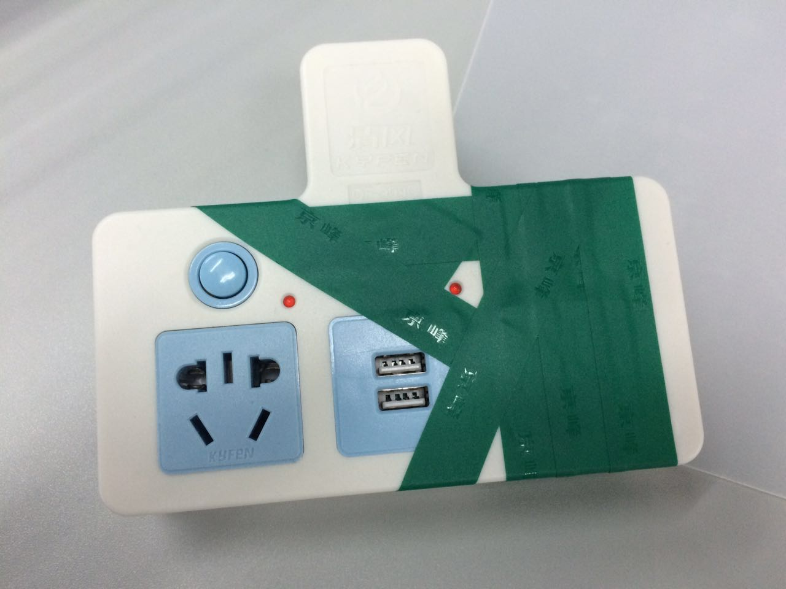
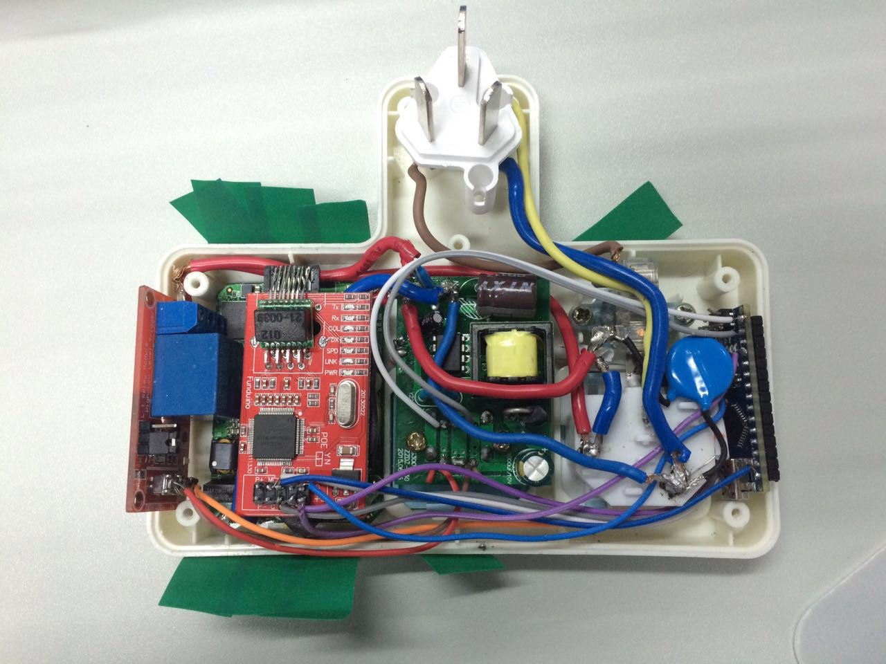
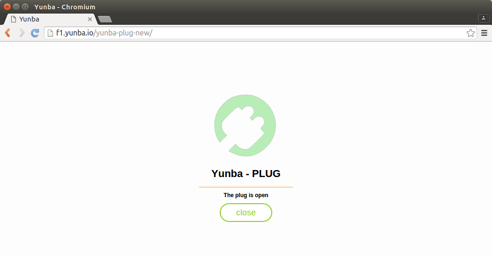

这里介绍基于 [电力载波][1] 的智能插座制作过程。

简介
--------

我们使用 [Arduino Nano][2] 作为控制器，硬件上连接一个 W5100 以太网模块，并通过一个载波模块连接上互联网，这样就省去了 WiFi 智能插座需要配置 WiFi 账号和密码的过程；软件上集成 [云巴实时消息服务][3]，从而达到通过 Web 或 App 实时控制插座以及查看插座状态的目的。

下图为制作完成的智能插座：

这是拆开后的内部图：

需要的元件
--------

1. 普通插座 1 个，作为各元件的容器，这里选带 USB 接口的是因为可以用来给 Arduino Nano 供电，[购买链接][4]。
2. Arduino Nano 1 个，作为控制器，[购买链接][5]。
3. W5100 以太网模块 1 个，作为网络模块， [购买链接][6]。
4. 继电器 1 个，用于开关交流电，[购买链接][7]。
5. 电力猫 2 个，其中一个接网线，另一个拆开取出电路板安装在智能插座里面，[购买链接][8]。
6. 各种导线若干，见智能插座内部图。

代码
--------

首先将 [云巴 Arduino SDK][12] 下载到 [Arduino IDE][10] 安装目录的 libraries 目录下，然后将智能插座的 [开源代码][9] 使用 [Arduino IDE][10] 编译并烧录到 Arduino Nano 上。

硬件连接
--------

用插座本身的 USB 接口给 Arduino Nano 供电，因此 USB 的 5V 和 GND 分别接 Arduino Nano 的 VIN 和 GND；同样 USB 的 5V 和 GND 也分别接继电器的 DC+ 和 DC-。Arduino Nano 与 W5100 通过 SPI 的通信，通信接口为（D10(SS)，D11(MOSI)，D12(MISO)，D13(SCK)），总的连线如下，参考智能插座内部图：

| Arduino Nano | W5100 | 插座 | 继电器 | 载波模块 |
|--------|--------|--------|--------|--------|
| VIN |  | USB 5V | DC+ |  |
| GND |  | USB GND | DC- |  |
| D9 |  |  | IN |  |
| 5V | +5 |  |  |  |
| GND | G |  |  |  |
| D10 | SS |  |  |  |
| D11 | MO |  |  |  |
| D12 | MI |  |  |  |
| D13 | CK |  |  |  |
|  |  | LIN(输入火线) | COM | L(火线) |
|  |  | NIN(输入零线) |  | N(零线) |
|  |  | LOUT(输出火线) | NO |  |
|  | RJ45 |  |  | RJ45 |

安装及测试
------

按照上面连接方式，并参考智能插座内部图，将各元件连接并安装好，因为涉及到 220V 的交流电，需要特别注意安全。

安装完成后，先将购买的另一个电力猫接电源及网线使其正常工作，然后将智能插座接同电源。正常情况下智能插座会连上网络并进行工作。然后就可以通过 [Web][11] 端查看其状态并对其进行控制了。需要注意的是要保证智能插座中的 Appkey，Devid，Topic等参数与 Web 中的一致。Web 端如下图：

[1]: http://baike.baidu.com/link?url=Ca4yLvcnBnkrDtn90-njvbcGyial1nmojsY_3XqFi2RbO0fYYXcSGliIn4_jKv3KnJ3kPpOujq-kJhfUrllB_a
[2]: https://www.arduino.cc/en/Main/ArduinoBoardNano
[3]: http://yunba.io
[4]: https://detail.tmall.com/item.htm?id=42672992236&spm=a1z09.2.0.0.BW6MaH&_u=m3u3sjdfaf3&skuId=72553390171
[5]: https://detail.tmall.com/item.htm?id=523757480736&spm=a1z09.2.0.0.YEN2J3&_u=m3u3sjd196f
[6]: https://item.taobao.com/item.htm?spm=a1z09.2.0.0.YEN2J3&id=45850454721&_u=m3u3sjd290e
[7]: https://detail.tmall.com/item.htm?id=39511836174&spm=a1z09.2.0.0.BW6MaH&_u=m3u3sjd3e42
[8]: http://item.jd.com/773860.html
[9]: https://github.com/shdxiang/yunba-smartoffice/blob/master/arduino/sketch_plug/sketch_plug.ino
[10]: https://www.arduino.cc/en/Main/Software
[11]: http://f1.yunba.io/yunba-plug-new/
[12]: https://github.com/shdxiang/yunba-arduino-sdk
