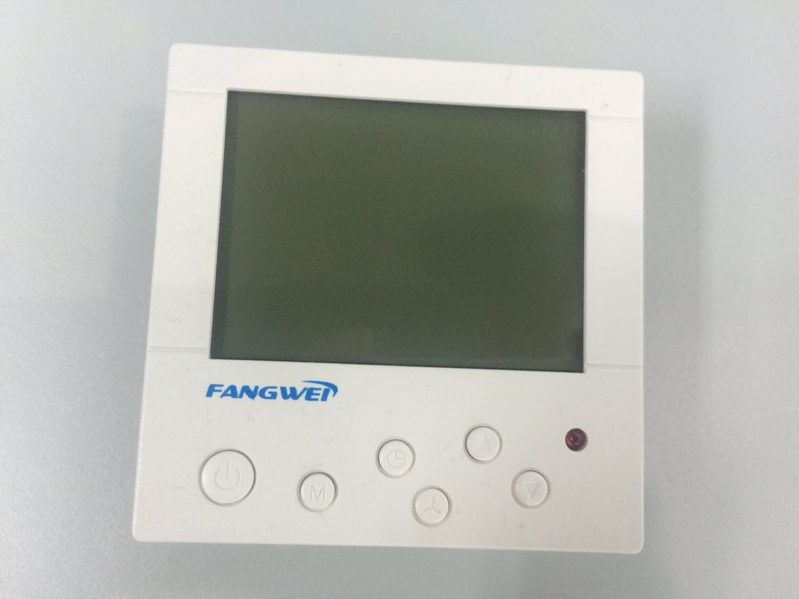
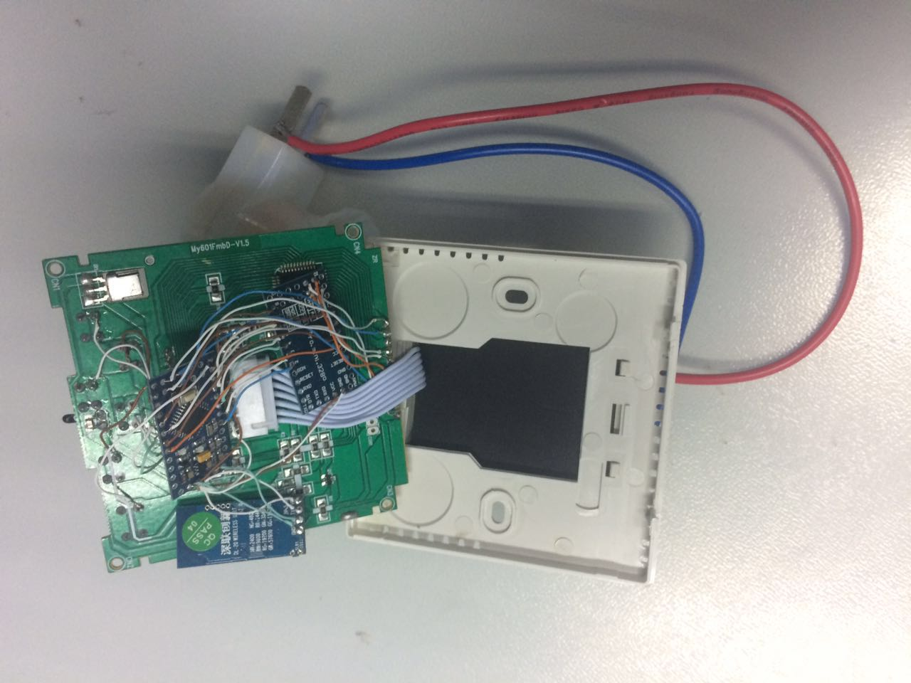
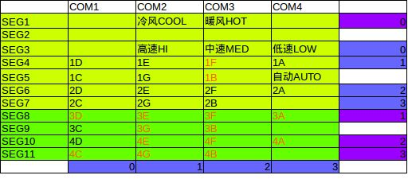
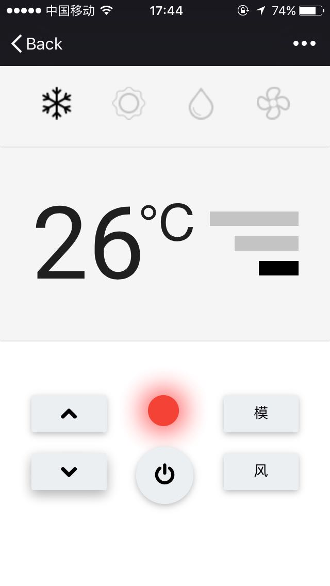

这里介绍方威智能空调面板的制作过程。

简介
--------

我们使用 [Arduino Pro Mini][2] 和一个基于 [Zigbee][3] 的串口模块，集成到一个普通空调面板内部，制作成一个智能空调面板；将另一个基于 Zigbee 的串口模块作为网关，与智能开关通讯，并通过 [云巴实时消息服务][4] 接入互联网；从而达到可以使用 Web 或 App 实时控制空调的目的；与 [智能开关][1] 不同的是：我们使用了两个 [Arduino Pro Mini][2]，其中一个用于辅助读面板的状态，因为一个  [Arduino Pro Mini][2] 的引脚不够用（参考后面的硬件连接）。

下图为制作完成的智能空调面板：

这是其内部图：

需要的元件
--------

1. 普通遥控开关 1 个，有 5V 直流输出，可以给 [Arduino Pro Mini][2] 及 Zigbee 模块供电，[购买链接][5]。
2. [Arduino Pro Mini][2] 2 个，一个作为控制器，以下称为主片；另一个用于辅助读面板的状态，称为从片，[购买链接][6]。
3. Zigbee 模块两个，一个集成在开关内部，另一个接入互联网，[购买链接][7]。
4. Arduino Pro Mini 专用 miniUSB 接口，用于烧写程序，[购买链接][8]。
5. USB 转串口线，用于连接 Zigbee 模块和 PC 机作为网关，[购买链接][9]。
6. 导线若干，见内部图。

代码
--------

将智能空调面板的 [主片开源代码][10] 和 [从片开源代码][11] 使用 [Arduino IDE][12] 分别编译并烧录到 两个 [Arduino Pro Mini][2] 上，最好做个标记以防止后面分不清那个是主，那个是从。还需要将另一个 Zigbee 模块通过 USB 转串线接在安装了 Python 的 PC 机上，并运行 [串口网关代码][13]。

硬件连接
--------

通过分析，我们发现空调面板 LCD 显示屏的控制信息如下：

其中数字加字母表示的是面板上某个数字（从左边数）按 7 段数码显示时的某段，如 2E 表示第 2 个数字的第 5 段，也就是`设置温度`的个位数的第 5 段。

连线如下：

| Arduino Pro Mini 主片 | Arduino Pro Mini 从片 | 空调面板 | Zigbee 模块 |
|--------|--------|--------|--------|
| VCC | VCC | VCC | VCC |
| GND | GND | GND | GND |
| TXD ||| RX |
| RXD ||| TX |
| A0 | A0 | COM1 ||
| A1 | A1 | COM2 ||
| A2 | A2 | COM3 ||
| A3 | A3 | COM4 ||
| A4 || SEG1 ||
| A5 || SEG8 ||
| A6 || SEG10 ||
| A7 || SEG11 ||
| 2 | 2 |||
| 3 | 3 |||
| 4 | 4 |||
| 5 | 5 |||
| 6 | 6 |||
| 7 | 7 |||
| 8 | 8 |||
| 9 || 开关按钮 ||
| 10 || 模式按钮 ||
| 11 || 风速按钮 ||
| 12 || 升温按钮 ||
| 13 || 降温按钮 ||
|| A4 | SEG3 ||
|| A5 | SEG4 ||
|| A6 | SEG6 ||
|| A7 | SEG7 ||

安装及测试
------

安装之前需要先配置 Zigbee 模块，我们配置成：波特率 115200，点对点模式。使两个模块能正常通讯，参考模块厂家的 [配置视频][14]。

配置好后，将各元件连接，并安装好。将空调面板连接空调正常工作；并将另一个 Zigbee 模块通过 USB 转串线接在安装了 Python 的 PC 机上，并运行串口网关代码。正常情况下就可以通过 Web 页面查看其状态并设置空调。需要注意的是要保证开关代码和串口网关代码中的 `Appkey`，`Devid`，`Topic` 等参数与 Web 中的一致，效果如下图：

[1]: #
[2]: https://www.arduino.cc/en/Main/ArduinoBoardProMini
[3]: http://baike.baidu.com/link?url=Kcwx8ighfWCVc23x2V7q3uK0NhGk4vNAUnnUN4zYJFWbWpq68GvjoJHRJlOZsVZILpR_RJcBoes6-WNrCVW0Mq
[4]: http://yunba.io
[5]: https://detail.tmall.com/item.htm?id=523024044085&skuId=3113681625989
[6]: https://item.taobao.com/item.htm?id=521709260567
[7]: https://item.taobao.com/item.htm?id=520850867141
[8]: https://item.taobao.com/item.htm?id=521709808584
[9]: https://item.taobao.com/item.htm?id=45811340839
[10]: https://github.com/yunbademo/yunba-smartoffice/blob/master/arduino/sketch_tc/sketch_tc.ino
[11]: https://github.com/yunbademo/yunba-smartoffice/tree/master/arduino/sketch_tc_slave
[12]: https://www.arduino.cc/en/Main/Software
[13]: https://github.com/yunbademo/yunba-smartoffice/blob/master/python/serial_gateway.py
[14]: http://www.tudou.com/programs/view/gJOcbx7MX4w/

