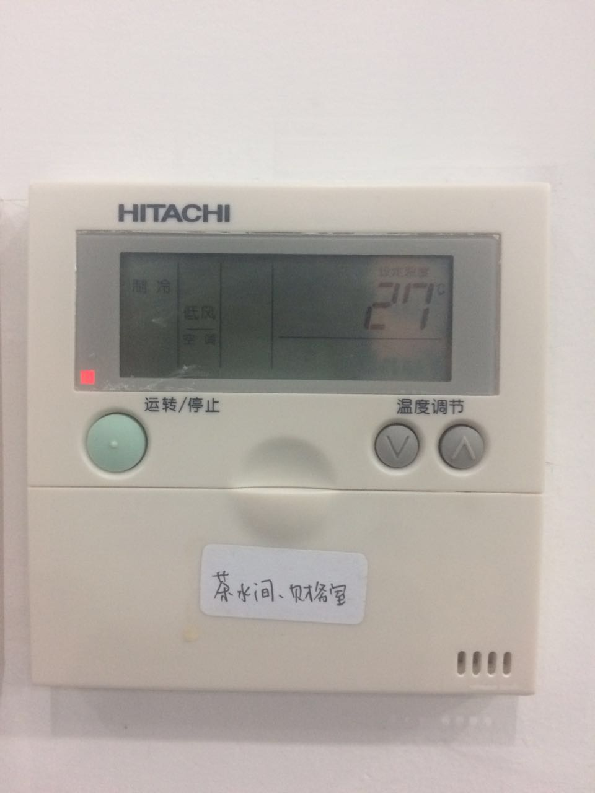
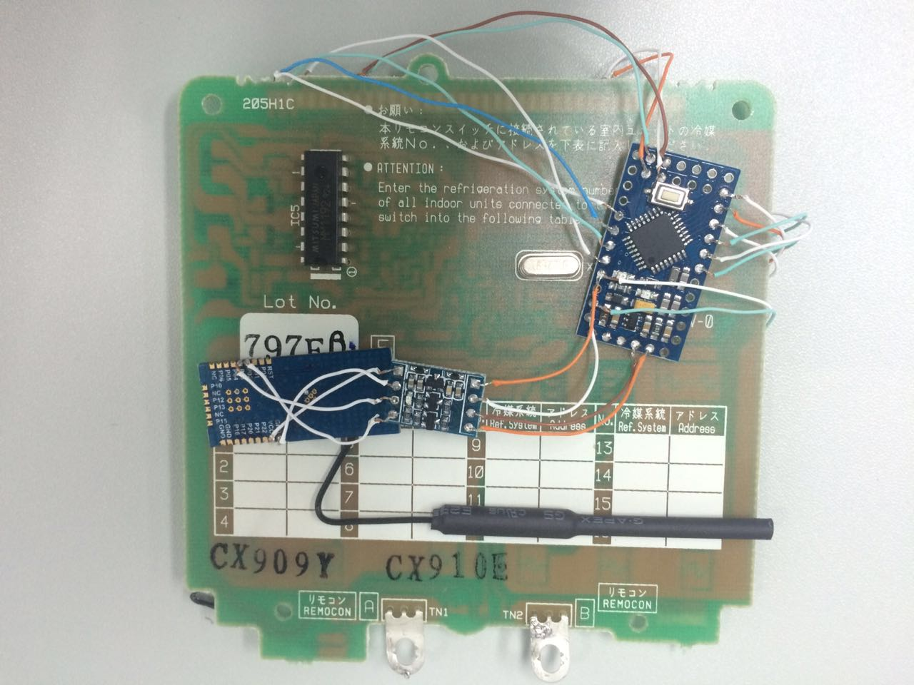
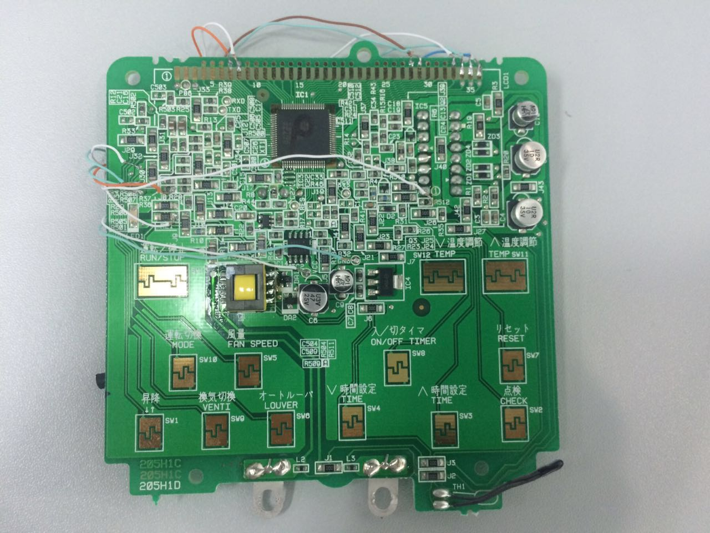
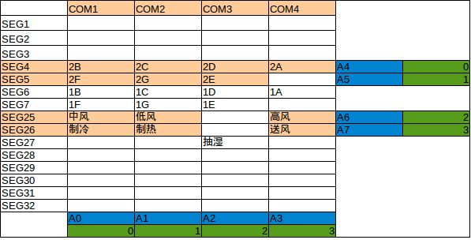
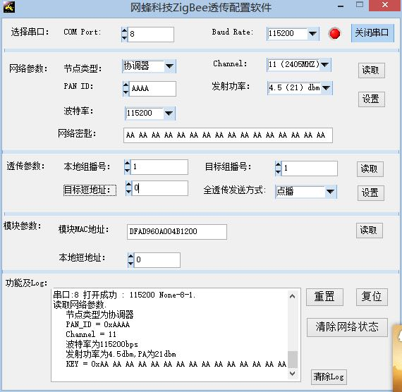
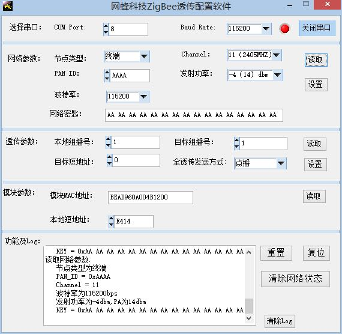

这里介绍日立智能空调面板的制作过程。

简介
--------

我们使用一个 [Arduino Pro Mini][2] 和一个基于 [Zigbee][3] 的串口模块，集成到日立空调面板内部，制作成一个智能空调面板；将另一个基于 Zigbee 的串口模块作为 Zigbee 协调器，并通过 [云巴实时消息服务][4] 接入互联网；从而可以使用 Web 或 App 实时查看空调状态和控制空调，而且现场对空调的设置也会实时的反应在远程界面上。

下图为制作完成的智能空调面板：

这是其内部图：

需要的元件
--------

1. 日立空调面板（PC-P1H1Q） 1 个，[购买链接][5]。
2. [Arduino Pro Mini][2] 1 个，一个作为控制器，[购买链接][6]。
3. Zigbee 模块 2 个带天线（如果你有多个面板的话，请按需购买），一个集成在面板内部，另一个作为协调器接入互联网，[购买链接][7]。
4. Arduino Pro Mini 专用 miniUSB 接口，用于烧写程序，[购买链接][8]。
5. USB 转串口线，用于连接 Zigbee 模块和 PC 机作为协调器，[购买链接][9]。
6. 5V 转 3.3V 电平转换模块 1 个，因为面板供电为 5V，而 Zigbee 模块需要 3.3V，，[购买链接][15]。
7. 导线若干，见内部图。

代码
--------

将智能空调面板的 [开源代码][10] 使用 [Arduino IDE][12] 编译并烧录到 [Arduino Pro Mini][2] 上。还需要将作为协调器的 Zigbee 模块通过 USB 转串线接在安装了 Python 的 PC 机上，并运行 [协调器代码][13]。（需要把代码中 `Appkey`，`Devid`，`Topic` 等参数修改成你自己的参数）

硬件连接
--------

通过分析，我们发现空调面板 LCD 显示屏的控制信息如下：

其中数字加字母表示的是面板上某个数字（从左边数）按 7 段数码显示时的某段，如 2E 表示第 2 个数字的第 5 段。

连线如下：

| Arduino Pro Mini | 空调面板 | Zigbee 模块 |
|--------|--------|--------|--------|
| VCC | VCC | VCC |
| GND | GND | GND |
| TXD || RX |
| RXD || TX |
| A0 | LCD35 ||
| A1 | LCD34 ||
| A2 | LCD33 ||
| A3 | LCD32 ||
| A4 | LCD29 ||
| A5 | LCD28 ||
| A6 | LCD8 ||
| A7 | LCD7 ||
| 3 | RUN/STOP ||
| 4 | MODE ||
| 5 | FAN SPEED ||
| 6 | TEMP SW11 ||
| 7 | TEMP SW12 ||
| 8 | LED1(Right pin of R21) ||

安装及测试
------

安装之前需要先配置 Zigbee 模块，请参考模块卖家的配置资料，我们把协调器配置成如下图：

而面板中的模块配置成终端，如下图：

配置好后，将各元件连接，并安装好。将空调面板连接空调正常工作；并将协调器通过 USB 转串线接在安装了 Python 的 PC 机上，并运行协调器代码。正常情况下就可以通过 Web 页面查看其状态并设置空调。需要注意的是要保证代码中的 `Appkey`，`Devid`，`Topic` 等参数与 Web 中的一致，效果如下图：

[1]: #
[2]: https://www.arduino.cc/en/Main/ArduinoBoardProMini
[3]: http://baike.baidu.com/link?url=Kcwx8ighfWCVc23x2V7q3uK0NhGk4vNAUnnUN4zYJFWbWpq68GvjoJHRJlOZsVZILpR_RJcBoes6-WNrCVW0Mq
[4]: http://yunba.io
[5]: https://item.taobao.com/item.htm?id=44459004526
[6]: https://item.taobao.com/item.htm?id=521709260567
[7]: https://item.taobao.com/item.htm?id=39111711624
[8]: https://item.taobao.com/item.htm?id=521709808584
[9]: https://item.taobao.com/item.htm?id=45811340839
[10]: https://github.com/yunbademo/yunba-smartoffice/blob/master/arduino/sketch_tc_hitachi/sketch_tc_hitachi.ino
[11]: #
[12]: https://www.arduino.cc/en/Main/Software
[13]: https://github.com/yunbademo/yunba-smartoffice/blob/master/python/zigbee_coordinator.py
[14]: #
[15]: https://item.taobao.com/item.htm?id=38696230888

